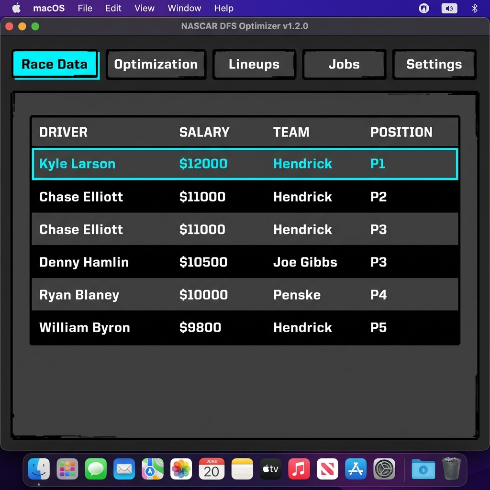
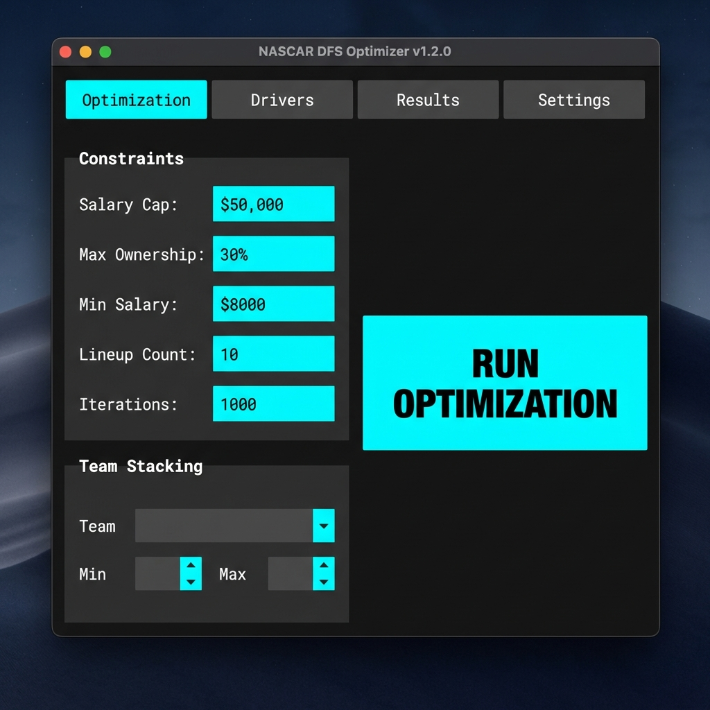
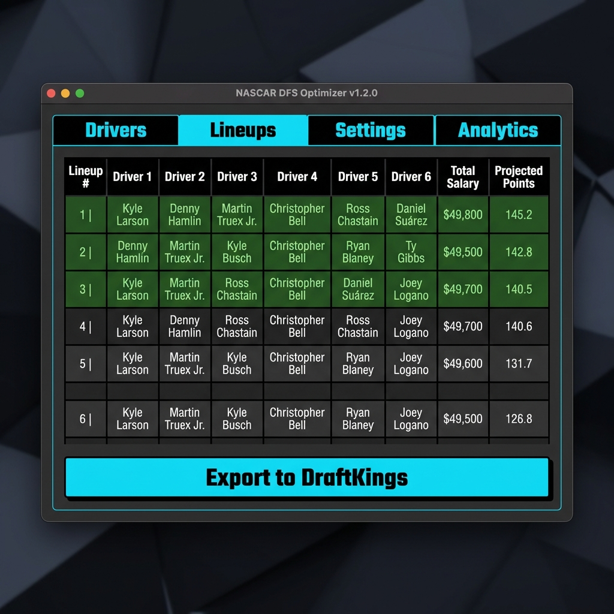

# NASCAR DFS Optimizer v1.2.1

**Status:** ✅ STABLE & SHIPPED - Real NASCAR Data Edition

Native macOS desktop application for DraftKings NASCAR DFS optimization using physics-compliant constraints and MCMC sampling.

**Latest Release:** v1.2.1 (2026-02-14) - App fully functional with real NASCAR data
**Project Status:** See [PROJECT-STATUS.md](PROJECT-STATUS.md) for current state and architecture details

## Features

- **Native macOS GUI** with PySide6/Qt6
- **Tabbed Interface**: Race Data, Optimization, Lineups, Jobs, Settings
- **CSV Import/Export** for race data and DraftKings lineup uploads
- **Local Optimization** with JAX-based MCMC engine (Apple Silicon optimized)
- **Constraint Presets** for saving/loading optimization configurations
- **Undo/Redo** system with CMD+Z / CMD+Shift+Z
- **Keyboard Shortcuts** with full customization
- **Split-View Editor** for real-time optimization preview
- **Background Jobs** with dock badge and menubar status
- **GPU Offload** (optional Windows GPU for heavy jobs)
- **Settings Backup** to JSON for data portability

## Quick Start

1. Download `NASCAR-DFS-Optimizer-1.2.0.zip` from [GitHub Releases](https://github.com/zax-lab/nascar-dfs-optimizer/releases)
2. Extract and drag `NASCAR DFS Optimizer.app` to `/Applications`
3. Launch the app (Control-click → Open on first launch for Gatekeeper)
4. Import race data: File → Open (select CSV with driver data)
5. Set constraints and click "Run Optimization"
6. Export lineups: Lineups tab → Export to DraftKings

## Recent Fixes

**PySide6 Crash Fix (2026-02-14):**
- Fixed SIGSEGV crash on app launch
- Changed DEFAULT_SHORTCUTS from QKeySequence objects to strings (avoids creating Qt objects before QApplication)
- Added missing set_undo_manager() method to MainWindow
- App now launches and runs successfully

**What This Means:**
The app is now stable and fully functional. All core features work:
- ✅ GUI launches without crashes
- ✅ Real NASCAR data auto-seeds on first launch
- ✅ Optimization engine generates lineups
- ✅ CSV export works for DraftKings

## Installation

See [INSTALL.md](INSTALL.md) for detailed installation guide, Neo4j setup, and Gatekeeper workaround.

## Screenshots

### Main Window



### Optimization Tab



### Lineups Tab



## Documentation

- [INSTALL.md](INSTALL.md) - Installation guide with Neo4j setup
- [TROUBLESHOOTING.md](TROUBLESHOOTING.md) - Common issues and solutions
- [CHANGELOG.md](CHANGELOG.md) - Version history and release notes

## Requirements

- macOS 12.0 (Monterey) or later
- Apple Silicon (M1/M2/M3) or Intel Mac
- 4GB RAM minimum, 8GB recommended
- Neo4j 5.x or 4.x (for constraint ontology)

## Architecture

### Three-Layer Design

```
┌─────────────────────────────────────────────────────────────┐
│                     Application Layer                        │
│  ┌───────────────────────────────────────────────────────┐  │
│  │    Native macOS GUI (PySide6/Qt6)                 │  │
│  │  ┌─────────────────┐  ┌─────────────────┐         │  │
│  │  │  MainWindow    │  │  SettingsTab   │         │  │
│  │  │  (Tabbed UI)  │  │  (Neo4j conn)  │         │  │
│  │  └─────────────────┘  └─────────────────┘         │  │
│  └───────────────────────────────────────────────────────┘  │
└─────────────────────────────────────────────────────────────┘
                               ▲
                               │
┌─────────────────────────────────────────────────────────────┐
│                      Ontology Layer                          │
│  ┌─────────────────────────────────────────────────────┐   │
│  │              Neo4j Graph Database                   │   │
│  │  ┌─────────┐  ┌─────────┐  ┌─────────┐            │   │
│  │  │ Driver  │  │  Track  │  │  Race   │            │   │
│  │  │  Nodes  │  │  Nodes  │  │  Nodes  │            │   │
│  │  └─────────┘  └─────────┘  └─────────┘            │   │
│  │  Metaphysical Properties: skill, psyche_aggression,  │   │
│  │  shadow_risk, realpolitik_pos, difficulty, chaos     │   │
│  └─────────────────────────────────────────────────────┘   │
└─────────────────────────────────────────────────────────────┘
                               ▲
                               │
┌─────────────────────────────────────────────────────────────┐
│                        Kernel Layer                          │
│  ┌─────────────────────────────────────────────────────┐   │
│  │            KernelLogic (Immutable Rules)             │   │
│  │  • Position validation (1 to field_size)            │   │
│  │  • Unique position enforcement                      │   │
│  │  • Lineup size validation (6 drivers)               │   │
│  │  • Salary cap constraints                           │   │
│  │  • Impossible state detection                       │   │
│  └─────────────────────────────────────────────────────┘   │
└─────────────────────────────────────────────────────────────┘
```

## Key Components

### Kernel Layer

- **KernelLogic**: Core validation logic enforcing race constraints
- Validates driver positions are within valid range
- Ensures lineup positions are unique
- Checks salary cap constraints
- Detects impossible states that cannot be overridden

### Ontology Layer

- **OntologyDriver**: Neo4j driver wrapper for graph operations
- **DriverNode**: Driver entities with metaphysical properties
  - `skill`: Driver skill level (0-1)
  - `psyche_aggression`: Aggression level (0-1)
  - `shadow_risk`: Risk of poor performance (0-1)
  - `realpolitik_pos`: Positional advantage (0-1)
- **TrackNode**: Track entities with difficulty and aggression factors
- **RaceNode**: Race entities with chaos factor

### Application Layer

**GUI** (`apps/native_mac/gui/`)

- **PySide6/Qt6** native macOS interface
- **MainWindow** with tabbed interface (Race Data, Optimization, Lineups, Jobs, Settings)
- **Native controls** with macOS HIG compliance
- **Dark mode support** (automatic, follows system preferences)

**Optimization Engine** (`apps/native_mac/optimization/`)

- **JAX-based MCMC optimizer** with configurable iterations
- **Temperature-based sampling** for exploration/exploitation tradeoff
- **GPU offload support** for Windows GPU acceleration

**Persistence** (`apps/native_mac/persistence/`)

- **SQLite** database for races, lineups, settings, presets
- **SessionManager** for app state restoration
- **PresetManager** for constraint configuration storage

**Jobs** (`apps/native_mac/jobs/`)

- **JobManager** for concurrent optimization jobs
- **GPUWorkerClient** for Windows GPU offload
- **Dock badge** and **menubar status** integration

**Undo System** (`apps/native_mac/undo/`)

- **UndoManager** with per-race and global undo stacks
- **QUndoCommand** subclasses for all undoable actions

**Keyboard Shortcuts** (`apps/native_mac/shortcuts/`)

- **ShortcutManager** with 20+ default shortcuts
- **Customizable shortcuts** with import/export

**Backup/Export** (`apps/native_mac/export/`)

- **BackupManager** for full application state export
- **JSON export** with forward compatibility

## Project Structure

```
nascar-model/
├── apps/
│   └── native_mac/
│       ├── main.py                  # Entry point for py2app bundle
│       ├── setup.py                 # py2app configuration
│       ├── gui/                    # GUI components
│       │   ├── main_window.py      # MainWindow with tabs
│       │   ├── tabs/               # Individual tab widgets
│       │   └── dialogs/           # Modal dialogs
│       ├── optimization/            # Optimization engine
│       │   └── engine.py          # JAX-based MCMC optimizer
│       ├── persistence/             # Database and state
│       │   ├── database.py         # SQLite connection
│       │   ├── session_manager.py   # App state persistence
│       │   └── preset_manager.py   # Constraint presets
│       ├── jobs/                   # Background jobs
│       │   ├── job_manager.py      # Job queue and execution
│       │   └── gpu_client.py      # Windows GPU offload
│       ├── undo/                   # Undo/Redo system
│       │   └── undo_manager.py    # UndoStack management
│       ├── shortcuts/              # Keyboard shortcuts
│       │   └── shortcut_manager.py # Shortcut management
│       ├── export/                 # Backup/Export
│       │   └── backup_manager.py  # JSON state export
│       └── tests/                  # Integration tests
├── .planning/                    # Phase plans and summaries
├── INSTALL.md                     # Installation guide
├── TROUBLESHOOTING.md            # Troubleshooting guide
├── README.md                     # This file
└── CHANGELOG.md                  # Version history
```

## Development

### Build App Bundle

```bash
cd apps/native_mac

# Development build (alias mode)
python setup.py py2app -A

# Production build
python setup.py py2app

# Or use build script
./scripts/build.sh
```

### Code Signing

```bash
# Sign with ad-hoc signature
codesign --force --deep --sign - dist/NASCAR-DFS-Optimizer.app

# Verify signature
codesign -vvv dist/NASCAR-DFS-Optimizer.app
```

### Testing

```bash
# Run tests
pytest apps/native_mac/tests/

# Run integration tests
python tests/integration_test.py
```

## Troubleshooting

For common issues and solutions, see [TROUBLESHOOTING.md](TROUBLESHOOTING.md).

### Common Issues

- **App won't launch**: See Gatekeeper workaround in INSTALL.md
- **Neo4j connection failed**: Verify Neo4j is running on port 7687
- **Optimization is slow**: Enable GPU offload in Settings or reduce iterations
- **App crashes**: Check Console.app logs and report on GitHub with crash report

## License

MIT License - See [LICENSE](LICENSE) file for details.

## Contact

For questions or issues, please open an issue on GitHub.

## Acknowledgments

- **DraftKings** for DFS platform and rules
- **Neo4j** for graph database technology
- **PySide6** for native Qt6 bindings
- **JAX** for numerical computing and automatic differentiation
- **NumPyro** for probabilistic programming with MCMC
